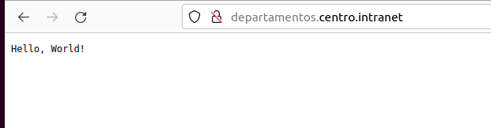

# Práctica Servidores web | 1º Trimestre

## 1. Instalación del servidor web apache

- Empezamos haciendo un update e instalando el servidor apache

```bash
sudo apt update
sudo apt install apache2
```
- Segido añadiremos loa dominios correspondientes. Para añadirlos no diregimos a al archivo **/etc/host** y añadimos las siguientes lineas:
```bash
127.0.0.1 centro.intranet
127.0.0.1 departamentos.centro.intranet
```

## 2. Instalación de los modulos necesario para mysql y php. 

- Para la intalacion de php con los modulos necesario ejecutamos el siguiente comando
```shell
sudo apt install php libapache2-mod-php php-mysql php-curl php-gd php-xml php-mbstring php-xmlrpc php-zip php-soap php-intl -y
```
- Ahora instalamos mysql 
```shell
apt install mysql-server -y
```
## 3. Instalacion y configuracion de WordPress

- Crearemos un base de datos que sera la que utilizara WordPress y un usuario que sera quien manejara el wordpress

```shell
sudo mysql
mysql> CREATE DATABASE wordpressdb;
mysql> CREATE USER 'wordpress'@'%' IDENTIFIED BY 'password';
mysql> GRANT ALL PRIVILEGES ON 'wordpress'@'%' WHITH GRANT OPTION;
mysql> FLUSH PRIVILEGES;
```
- Creamos una carpeta en /var/www/html llamada centro.intranet
```shell
cd /var/www/html
mkdir centro.intranet
```

- Nos descargamos el archivo de wordpress y extraemos el archivo
```shell
wget -c http://wordpress.org/latest.tar.gz
tar -xzvf latest.tar.gz
```
- Cambiamos los permisos de la carpeta
```shell
sudo chown -R www-data:www-data centro.intranet
sudo chmod -R 755 centro.intranet
```

- En la carpeta de etc/apache2/sites-available/ , crearemos un .conf para el el wordpress y agragamos la informacion.

```shell
sudo nano centro.intranet.conf

<VirtualHost *:80>
    ServerName centro.intranet
    ServerAdmin wordpress@localhost
    DocumentRoot /var/www/html/centro.intranet
    ErrorLog ${APACHE_LOG_DIR}/error.log
   CustomLog ${APACHE_LOG_DIR}/access.log comnined
</VirtualHost>

```
- Le agregamos la configuracion de ServerName al archivo apache2.conf. Comprobamos que si estan bien la configuracion.
```shell
sudo nano apache2.conf

ServerName localhost

apachectl -t
```
- Agregamos la configuracion de centro.intranet a los sitios activados, configuracion por default la colocamos en los sitios no activados
```shell
sudo a2ensite centro.intranet.conf 
sudo systemctl reload apache2

sudo a2dissite 000-default.conf
sudo systemctl reload apache2
```
- Nos vamos a la ruta de localhost para ver si todo ha salido bien.


- Damos a seguir y nos pedira que creemos el archivo wp-config.php, en la carpeta de var/www/html/centro.intranet creamos el archivo y pegamos la informacion que nos esta proporcionando, en los apartados de database, user y password pondremos el nombrede la base de datos que creamos, con el usuario quw creamos y su contraseña 


-Ahora si, rellenamos los datos que nos piden para instalar


- Nos logeamos. Comprobamos que que el si ya tenemos una pagina web 
si vamos a localhost o a http://centro.intranet/, debemos tener la misma pagina


## 4. Activar el módulo “wsgi” para permitir la ejecución de aplicaciones Python

- Creamos una carpeta donde estara nuestro archivo de python. esta estara en var/www/html, se llamara departamentos.centro.intranet creamos la carpeta y le daremos los permisos necesarios.

```shell
cd /var/www/html

mkdir departamentos.centro.intranet
nano app.py 
```
- Guardamos y ahora le daremos los permisos a la carpeta

```shell
sudo chown -R www-data:www-data departamentos.centro.intranet
sudo chmod -R 755 departamentos.centro.intranet
```
- En etc/apache2/sites-available creamos en .conf, y pondremos lla pagina en los sitios actiados

```shell
sudo nano departamentos.centro.intranet.conf

<VirtualHost *:80>
    ServerName departamentos.centro.intranet
    DocumentRoot /var/www/html/departamentos.centro.intranet
    WSGIScriptAlias / /var/www/html/departamentos.centro.intranet/app.py

    ErrorLog ${APACHE_LOG_DIR}/error.log
    CustomLog ${APACHE_LOG_DIR}/access.log combined
</VirtualHost>

sudo a2ensite departamentos.centro.intranet.conf 
sudo systemctl reload apache2
```
## 5 - Crea y despliega una pequeña aplicación python para comprobar que funciona correctamente.

- Creamos un archivo .py
```python
def application(environ, start_response):
    status = '200 OK'
    output = b'Hello, World!'
    
    response_headers = [('Content-type', 'text/plain'), ('Content-Length', str(len(output)))]
    start_response(status, response_headers)
    
    return [output]
```



## 6. Adicionalmente protegeremos el acceso a la aplicación python mediante autenticación

- A nuestro archivo .conf le agregamos los siguiente:
```shell
<Directory /var/www/html/departamentos.centro.intranet>
    AuthType Basic
    AuthName "Restricted Access"
    AuthUserFile /var/www/html/departamentos.centro.intranet/.htpasswd
    Require valid-user
</Directory>
```
- En la carpeta donde guardamos la aplicacion (departamentos.centro.intranet) creamos una archivo .htpasswd y le añadimos los permisos necesarios 

```shell
sudo htpasswd -c /var/www/html/departamentos.centro.intranet/.htpasswd usuario

sudo chmod 644 /var/www/html/departamentos.centro.intranet/.htpasswd
sudo chown www-data:www-data /var/www/html/departamentos.centro.intranet/.htpasswd

sudo systemctl restart apache2
```
- Comprobamos en la pagina


## 7. Instalamos awstat

- Instalamos awstat

```shell
sudo apt-get update
sudo apt-get install awstats
```
- Para editarlo

```shell
sudo nano /etc/awstats/awstats.conf
```
## 8. Configuración del segundo servidor con Nginx:

- Instalar Nginx y PHP
```shell
sudo apt-get install nginx php-fpm
```
- Instala phpMyAdmin
```shell
sudo apt-get install phpmyadmin
```

- Configura phpMyAdmin para Nginx
```shell
sudo nano /etc/nginx/sites-available/phpmyadmin

server {
    listen 8080;
    server_name phpmyadmin.centro.intranet;

    root /usr/share/phpmyadmin;
    index index.php index.html index.htm;

    location / {
        try_files $uri $uri/ =404;
    }

    location ~ \.php$ {
        include snippets/fastcgi-php.conf;
        fastcgi_pass unix:/var/run/php/php8.1-fpm.sock;
        fastcgi_param SCRIPT_FILENAME $document_root$fastcgi_script_name;
        include fastcgi_params;
    }

    location ~ /\.ht {
        deny all;
    }
}
```
- Guardamos y reiniciamos 
```shell
sudo ln -s /etc/nginx/sites-available/phpmyadmin /etc/nginx/sites-enabled/
sudo systemctl restart nginx
```

-Agregamos los dominios en etc/hosts

```shell
sudo nano /etc/hosts

127.0.0.1 servidor2.centro.intranet
127.0.0.1 phpmyadmin.centro.intranet
```

