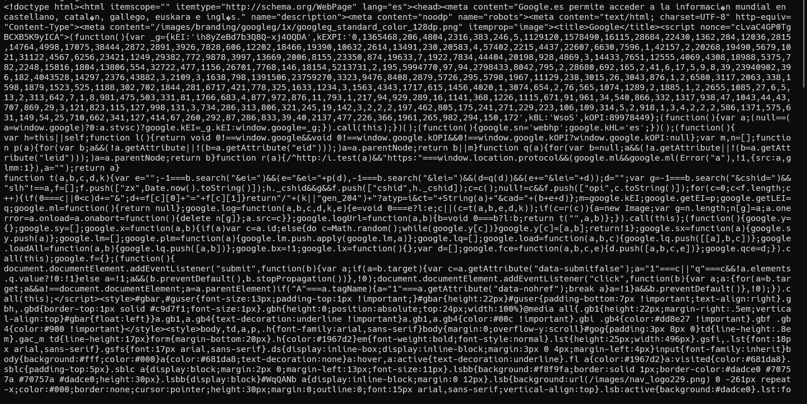
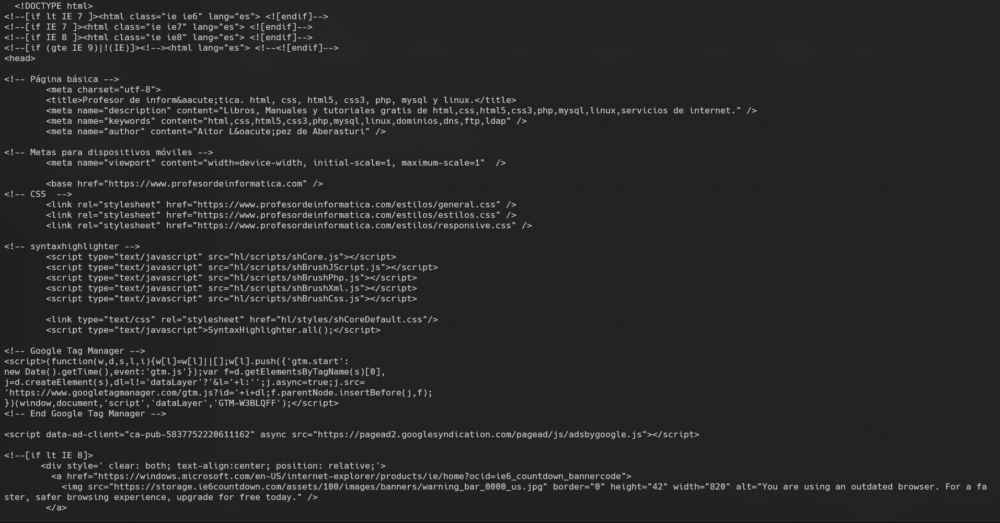

## Ejemplo de Uso de Curl

**Curl** es un comando de línea de comandos que se utiliza para transferir datos desde o hacia un servidor, utilizando una variedad de protocolos de red, como HTTP, HTTPS, FTP, FTPS, SCP, SFTP, LDAP, y más. El nombre "curl" es una abreviatura de "Client for URLs" (Cliente para URLs). 

### Pagina google.com
   ```shell
   curl www.google.com 80
   ```
Tendremos de salida el codigo fuente de la pagina:



### Pagina profesordeinformatica.com

   ```shell
   curl https://profesordeinformatica.com
   ```
Tendremos de salida el codigo fuente de la pagina:


