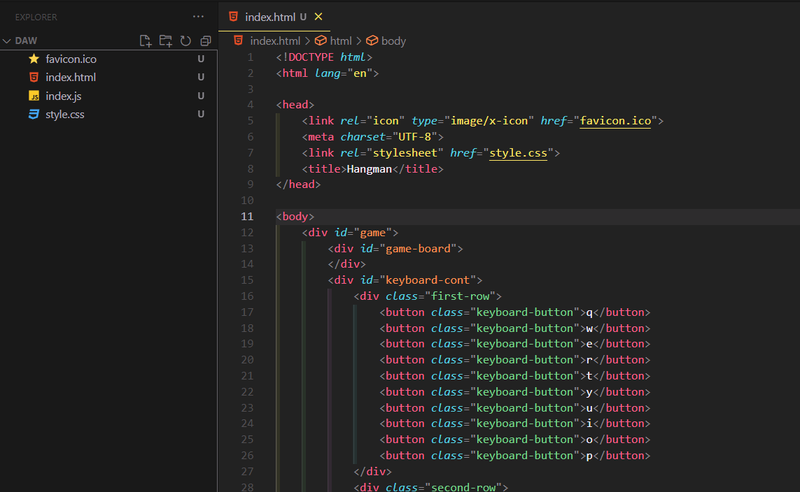
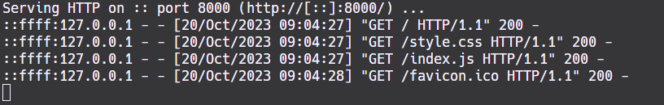
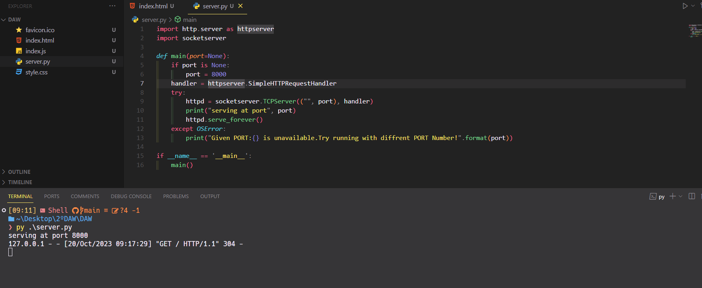

## Ejemplo de creacion de un servidor con Python

Para poder hacer el ejercicio crearemos una pagina html inicial, esta sera
la pagina que aparecera al abrir el servidor web.

### Servidor de forma nativa



Abriremos una terminal y nos ubicaremos en la carpeta donde esta nuestra pagina.
Una vez ahi ejecutamos el siguiente conmando:


 ```shell  
 python -m http.server 8000
 ```

Una vez inicado el servidor y habiendo entrado a la web(mediante la url de localhost:8000) tenderemos esta salida en la terminal:
    


###  Simple HTTP Server Implementation in Python 3 

Creamos un archivo python y utilizamos el codigo para la creacion del servidor.
Guardamos y ejecutamos el archivo .py, de la misma forma podremos comprobar la pagina web
en localhost:8000

 ```shell  
 py ./server.py
 ```



